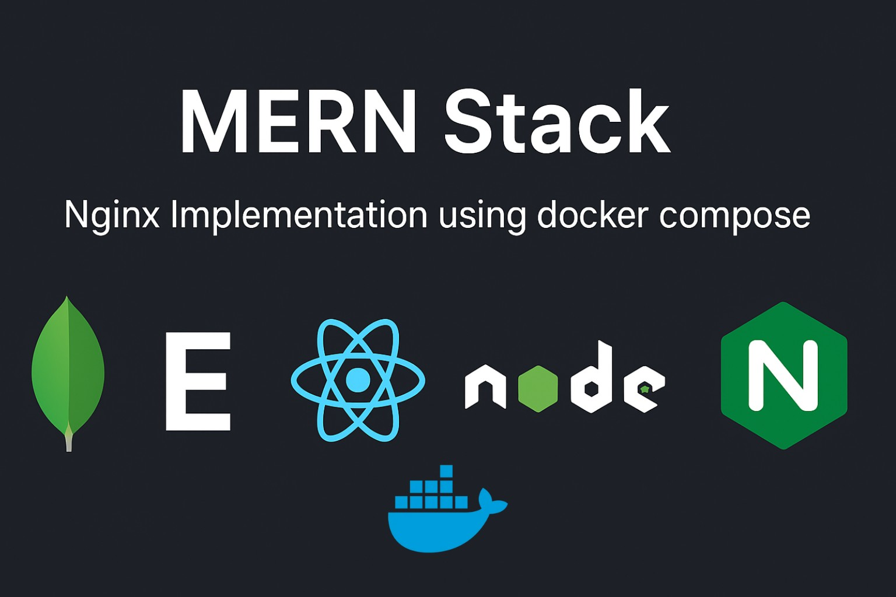

# Cloud Portfolio Website CI/CD using GitHub Actions


```

```


A personal portfolio website deployed on AWS infrastructure with automated CI/CD pipeline using GitHub Actions.

## Features

- 🚀 **Hosted on AWS S3** with CloudFront CDN for global distribution
- 🔒 **SSL secured** with HTTPS via CloudFront
- 🌐 **Custom domain** configured with Route 53
- ⚡ **Automated deployments** on git push to main branch
- 🔄 **Cache invalidation** for instant updates
- 📱 **Responsive design** works on all devices


## Project Structure

```
├── css/                   # All CSS stylesheets
├── fonts/                 # Custom fonts
├── images/                # Portfolio images and assets
│   ├── blog/              # Blog post images
│   ├── clients/           # Client logos
│   └── portfolio/         # Project showcase images
├── js/                    # JavaScript files
├── webfonts/              # Web font assets
├── project-*.html         # Project detail pages
├── .github/
|   └── workflows/
|        └── deploy.yml    # GitHub Actions workflow
└── index.html             # Main portfolio page
```

## CI/CD Pipeline

The GitHub Actions workflow (`deploy.yml`) performs the following:

1. Checks out the repository code
2. Configures AWS credentials
3. Syncs files to S3 bucket (excluding Git files)
4. Creates CloudFront cache invalidation

## Infrastructure Architecture

```

```


## Setup Instructions

### Prerequisites

- AWS account with S3, CloudFront, and Route 53 access
- GitHub repository with your portfolio code
- Custom domain (optional)

### Configuration

1. **AWS Setup**:
   - Create S3 bucket configured for static website hosting
   - Set up CloudFront distribution pointing to S3 bucket
   - Configure Route 53 for custom domain (optional)

2. **GitHub Secrets**:
   - `AWS_ACCESS_KEY_ID`: IAM user access key with S3 and CloudFront permissions
   - `AWS_SECRET_ACCESS_KEY`: IAM user secret key
   - `AWS_REGION`: Your AWS region (e.g., `us-east-1`)
   - `S3_BUCKET_NAME`: Your S3 bucket name
   - `CLOUDFRONT_DIST_ID`: Your CloudFront distribution ID

3. **Deployment**:
   - Push to `main` branch triggers automatic deployment
   - Monitor workflow runs in GitHub Actions tab

## Customization

- Edit HTML/CSS/JS files in respective directories
- Add/update images in the `images` directory
- Modify `deploy.yml` for additional build steps if needed

